# 🏖️ Trip Planner: AI-Powered Travel Intelligence with CrewAI


## Introduction

Trip Planner leverages the CrewAI framework to automate and enhance the trip planning experience with **AI-Powered Travel Intelligence**. It integrates a CLI, FastAPI, and a user-friendly Streamlit interface, now enhanced with cutting-edge intelligence features including real-time risk assessment, crowd density prediction, price optimization, and language assistance.

## ⚡ Quick Start

```bash
# 1. Clone and setup
git clone <repository-url>
cd Trip-Planner-using-CrewAI
pip install -r requirements.txt

# 2. Configure environment
cp .env.example .env
# Edit .env with your API keys

# 3. Run with intelligence features
python cli_app.py -o "New York" -d "Tokyo" -s 2025-06-01 -e 2025-06-10 -i "2 adults who love culture" --intelligence

# 4. Or use Streamlit UI
streamlit run streamlit_app.py
```

## 🧠 AI-Powered Travel Intelligence Features

### 🛡️ Dynamic Risk Assessment Agent
- **Real-time monitoring** of political situations, weather alerts, health advisories, and safety conditions
- **Weather risk analysis** using OpenWeatherMap API
- **Safety assessment** via web search and analysis
- **Health advisory monitoring** including COVID-19 restrictions
- **Risk scoring** with LOW/MEDIUM/HIGH levels and mitigation strategies

### 👥 Crowd Density Predictor
- **ML-powered predictions** for tourist density at attractions
- **Historical pattern analysis** combined with real-time factors
- **Time slot optimization** for best visit times
- **Crowd avoidance strategies** and alternative attraction suggestions
- **Weather and event impact** analysis

### 💰 Price Optimization Engine
- **Dynamic pricing analysis** for flights, hotels, and activities
- **Price trend predictions** and optimal booking timing
- **Alternative date suggestions** for better deals
- **Budget optimization** strategies and cost-saving recommendations

### 🗣️ Language Barrier Solver
- **Real-time translation** with cultural context
- **Local slang and idioms** integration
- **Cultural etiquette** guidance and formality levels
- **Emergency phrases** and pronunciation guides
- **Cultural sensitivity** recommendations

## CrewAI Framework

CrewAI simplifies the orchestration of role-playing AI agents. In VacAIgent, these agents collaboratively decide on cities and craft a complete itinerary for your trip based on specified preferences, all accessible via a streamlined Streamlit user interface.

### Flow Diagram



## 🚀 Running the Application

### Prerequisites

- **Configure Environment**: Set up the environment variables for [Browseless](https://www.browserless.io/), [Serper](https://serper.dev/), [OpenAI](https://openai.com/), [OpenWeatherMap](https://openweathermap.org/api), and [Google Translate](https://cloud.google.com/translate). Use the `.env.example` as a guide to add your keys.

- **Install Dependencies**: Execute `pip install -r requirements.txt` in your terminal.

### Quick Start

#### 🖥️ CLI Mode
```bash
# Basic trip planning
python cli_app.py -o "New York" -d "Tokyo" -s 2025-06-01 -e 2025-06-10 -i "2 adults who love culture and food"

# With AI intelligence features
python cli_app.py -o "New York" -d "Tokyo" -s 2025-06-01 -e 2025-06-10 -i "2 adults who love culture and food" --intelligence
```

#### 🌐 Streamlit Interface
```bash
streamlit run streamlit_app.py
```
- Fill in the form with your trip details
- Check "Enable AI-Powered Travel Intelligence" for advanced features
- Get comprehensive analysis with tabbed interface

#### 🔌 FastAPI Server
```bash
uvicorn api_app:app --reload
```

**API Endpoints:**
- `POST /api/v1/plan-trip` - Basic trip planning with optional intelligence features
- `POST /api/v1/intelligence-analysis` - Specific intelligence analysis (risk, crowd, price, language)
- `GET /api/v1/health` - Health check

**Example API Usage:**
```bash
# Basic trip with intelligence
curl -X POST "http://localhost:8000/api/v1/plan-trip" \
  -H "Content-Type: application/json" \
  -d '{
    "origin": "New York",
    "destination": "Tokyo", 
    "start_date": "2025-06-01",
    "end_date": "2025-06-10",
    "interests": "2 adults who love culture and food",
    "enable_intelligence": true
  }'
```

#### 🐳 Docker Deployment
```bash
# Using Docker Compose (Recommended)
docker-compose up --build

# Using Docker directly
docker build -t trip-planner .
docker run -p 8501:8501 --env-file .env trip-planner
```

★ **Disclaimer**: The application uses GEMINI by default. Ensure you have access to GEMINI's API and be aware of the associated costs.

## 📁 Project Structure

### Core Components
- **`streamlit_app.py`**: Main Streamlit interface with intelligence features
- **`cli_app.py`**: Command-line interface with `--intelligence` flag
- **`api_app.py`**: FastAPI server with intelligence endpoints
- **`trip_agents.py`**: Original trip planning agents
- **`trip_tasks.py`**: Original trip planning tasks

### 🧠 Intelligence Features
- **`intelligence_agents.py`**: AI-powered intelligence agents
- **`intelligence_tasks.py`**: Intelligence analysis tasks
- **`tools/risk_assessment_tools.py`**: Risk assessment and safety monitoring
- **`tools/crowd_density_tools.py`**: Crowd density prediction with ML
- **`tools/price_optimization_tools.py`**: Dynamic pricing and cost optimization
- **`tools/language_barrier_tools.py`**: Translation and cultural assistance

### 🛠️ Tools Directory
- **`tools/search_tools.py`**: Web search capabilities
- **`tools/browser_tools.py`**: Web scraping and content analysis
- **`tools/calculator_tools.py`**: Mathematical calculations

### 📚 Documentation
- **`INTELLIGENCE_FEATURES.md`**: Comprehensive intelligence features guide
- **`test_intelligence.py`**: Test script for validation
- **`Dockerfile`**: Docker configuration
- **`docker-compose.yaml`**: Container orchestration

## Using LLM Models

To switch LLMs from differnet Providers

```python
class TripAgents():
    def __init__(self, llm: BaseChatModel = None):
        if llm is None:
            #self.llm = LLM(model="groq/deepseek-r1-distill-llama-70b")
            self.llm = LLM(model="gemini/gemini-2.0-flash")
        else:
            self.llm = llm

```
[Connect to LLMs](https://docs.crewai.com/how-to/llm-connections#connect-crewai-to-llms)


### Integrating Ollama with CrewAI

Pass the Ollama model to agents in the CrewAI framework:

```python
    agent = Agent(
        role='Local AI Expert',
        goal='Process information using a local model',
        backstory="An AI assistant running on local hardware.",
        llm=LLM(model="ollama/llama3.2", base_url="http://localhost:11434")
    )
```


## Docker Setup

This document explains how to run the Trip Planner application using Docker.

## Prerequisites

- Docker installed on your system
- Docker Compose installed on your system

## Quick Start

### Using Docker Compose (Recommended)

1. **Build and run the application:**
   ```bash
   docker-compose up --build
   ```

2. **Run in detached mode:**
   ```bash
   docker-compose up -d --build
   ```

3. **Stop the application:**
   ```bash
   docker-compose down
   ```

4. **View logs:**
   ```bash
   docker-compose logs -f
   ```

### Using Docker directly

1. **Build the image:**
   ```bash
   docker build -t trip-planner .
   ```

2. **Run the container:**
   ```bash
   docker run -p 8501:8501 --env-file .env trip-planner
   ```

## 🔑 Environment Variables

Create a `.env` file in the project root with your API keys:

```env
# Core API Keys
GEMINI_API_KEY=your_gemini_api_key_here
SERPER_API_KEY=your_serper_api_key_here
BROWSERLESS_API_KEY=your_browserless_api_key_here

# Intelligence Features API Keys
OPENWEATHER_API_KEY=your_openweather_api_key_here
GOOGLE_TRANSLATE_API_KEY=your_google_translate_api_key_here

# Optional: Alternative LLM Providers
# OPENAI_API_KEY=your_openai_api_key_here
# GROQ_API_KEY=your_groq_api_key_here
```

### 🔗 Getting API Keys

1. **OpenWeatherMap** (Free): [Get API Key](https://openweathermap.org/api)
2. **Google Translate** (Optional): [Google Cloud Console](https://console.cloud.google.com/)
3. **Serper** (Search): [Serper.dev](https://serper.dev/)
4. **Browserless** (Web Scraping): [Browserless.io](https://www.browserless.io/)
5. **Gemini** (AI): [Google AI Studio](https://aistudio.google.com/)

## Accessing the Application

Once the container is running, you can access the application at:
- **Local URL:** http://localhost:8501
- **Network URL:** http://0.0.0.0:8501

## Health Check

The application includes a health check that monitors the Streamlit server. You can check the health status with:

```bash
docker-compose ps
```

## Troubleshooting

### Common Issues

1. **Port already in use:**
   - Change the port mapping in `docker-compose.yaml` from `8501:8501` to `8502:8501`
   - Access the app at http://localhost:8502

2. **Environment variables not loaded:**
   - Ensure your `.env` file is in the project root
   - Check that the `.env` file has the correct format

3. **Build failures:**
   - Check that all dependencies in `requirements.txt` are compatible with Python 3.13
   - Try rebuilding with `docker-compose up --build --no-cache`

### Viewing Logs

```bash
# View all logs
docker-compose logs

# Follow logs in real-time
docker-compose logs -f

# View logs for specific service
docker-compose logs trip-planner
```

## Development

For development, you might want to mount the source code as a volume:

```yaml
# Add to docker-compose.yaml under volumes
- .:/app
```

This allows you to see changes without rebuilding the image.

## 🧪 Testing

### Test Intelligence Features
```bash
# Run the test script
python test_intelligence.py
```

### Manual Testing
1. **CLI Testing**: Test with and without `--intelligence` flag
2. **Streamlit Testing**: Enable intelligence features in the UI
3. **API Testing**: Use the provided curl examples
4. **Docker Testing**: Test containerized deployment

## 🚨 Troubleshooting

### Common Issues

1. **Missing API Keys**:
   - Ensure all required API keys are set in `.env`
   - Check API key validity and permissions

2. **Import Errors**:
   - Run `pip install -r requirements.txt`
   - Check Python version compatibility (3.13+)

3. **API Rate Limits**:
   - Some APIs have rate limits; consider upgrading plans
   - Implement caching for repeated requests

4. **Memory Issues**:
   - Intelligence features use more memory
   - Ensure adequate system resources

5. **Network Connectivity**:
   - Check internet connection for external API calls
   - Verify firewall settings

### Debug Mode
Enable verbose logging by setting `verbose=True` in agent configurations.

### Performance Optimization
- Use Docker for consistent environment
- Monitor API usage and costs
- Implement caching strategies
- Consider async processing for better performance

## 🎯 Key Features Summary

| Feature | Description | API Required |
|---------|-------------|--------------|
| 🛡️ Risk Assessment | Real-time safety and weather monitoring | OpenWeatherMap |
| 👥 Crowd Density | ML-powered attraction crowd predictions | Serper |
| 💰 Price Optimization | Dynamic pricing and cost analysis | Serper |
| 🗣️ Language Assistance | Translation with cultural context | Google Translate |
| 🌐 Web Search | General information gathering | Serper |
| 🔍 Web Scraping | Content analysis and extraction | Browserless |

## 🔮 Future Enhancements

- Real-time data streaming
- Advanced ML models for predictions
- Mobile app integration
- Voice-based interactions
- Augmented reality features
- Social media integration
- Blockchain-based travel verification

## 📊 Performance Metrics

- **Response Time**: 30-60 seconds for full intelligence analysis
- **Memory Usage**: ~500MB-1GB with intelligence features
- **API Calls**: 10-20 calls per intelligence analysis
- **Accuracy**: 85-95% for predictions (varies by data source)

## 🤝 Contributing

1. Fork the repository
2. Create a feature branch
3. Make your changes
4. Add tests for new features
5. Submit a pull request

## 📄 License

Trip Planner is open-sourced under the MIT License.
